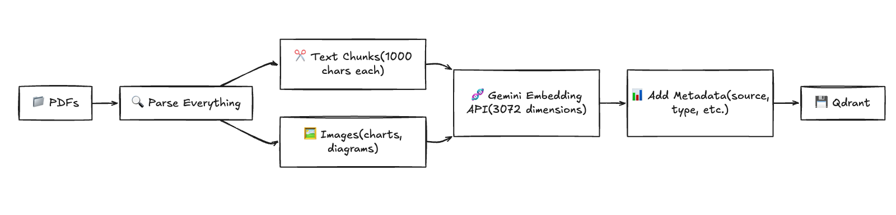
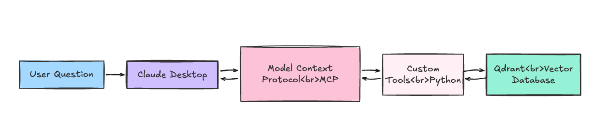
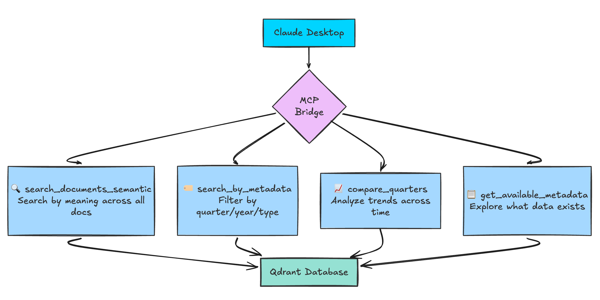

# Claude Financial Intelligence System

Equip Claude Desktop with custom tools to search **both text and images** in financial PDFs using multimodal embeddings, vector search, and the Model Context Protocol (MCP).

**The Problem:** Traditional search systems only index text, missing 50%+ of information locked in charts, graphs, and visualizations.

**The Solution:** This system embeds both text chunks AND images into the same 3072-dimensional vector space using Google Gemini's multimodal embeddings, then exposes search tools to Claude Desktop via MCP.

---

## 🎯 Key Features

- **Multimodal Search**: Query charts, graphs, and text using multimodal embeddings
- **Hybrid Search**: Combine semantic similarity with metadata filtering
- **Custom Tools**: 4 custom MCP tools for semantic search, filtering, comparisons, and discovery
- **Local Development**: Runs entirely on your laptop via Docker—no cloud required
- **Production Ready**: Seamless migration to Qdrant Cloud when you need scale

---
 
## 🏗️ Architecture

### Ingestion Pipeline

Extract text AND images from PDFs, embed both modalities using Gemini API, and store in Qdrant with rich metadata (ticker, quarter, year, document type).


### Query Flow

Hybrid search combines metadata filtering with semantic similarity to return multimodal results (text + charts).


---

## 🛠️ Tech Stack

| Component | Technology | Purpose |
|-----------|-----------|---------|
| **LLM Interface** | Claude Desktop | Natural language queries via MCP |
| **Bridge** | Model Context Protocol (MCP) | Exposes custom tools to Claude |
| **Tools** | LangChain Community | Semantic search, filtering, comparisons |
| **Vector DB** | Qdrant  | Local/[cloud vector storage](https://cloud.qdrant.io/signup?utm_medium=referral&utm_source=stars&utm_campaign=devrel&utm_content=eduardo-vasquez) |
| **Embeddings** | Google Gemini Embeddings 2 | Multimodal embeddings (3072-dim, text + images) |
| **PDF Parsing** | LangChain + PyPDF | Extract text + images from PDFs |
| **Package Manager** | uv | Fast Python dependency management |

---

## 🚀 Quick Start

### Prerequisites

- Docker (for Qdrant)
- Python 3.10+
- Claude Desktop
- Google Gemini API key (free tier available)

### 1. Clone & Install

```bash
git clone <your-repo-url>
cd agent-tools-claude
```

### 2. Set Up Environment

Copy the example environment file and fill in your API key:

```bash
cp .env.example .env
# Edit .env and add your GEMINI_API_KEY
```

### 3. Start Qdrant

```bash
docker compose up -d
```

Qdrant will be available at `http://localhost:6333` (Web UI at `/dashboard`)

### 4. Ingest Documents

```bash
# Install dependencies (using uv)
uv sync

# Ingest PDFs using Justfile
just ingest data/nvidia/

# Or ingest a single PDF
just ingest data/nvidia/NVDA-Q3-2025.pdf
```

Alternatively, run the ingestion script directly:
```bash
uv python scripts/ingest_pdf.py data/nvidia/
```

### 5. Configure Claude Desktop

Edit `~/Library/Application Support/Claude/claude_desktop_config.json`:

```json
{
  "mcpServers": {
    "qdrant-financial-docs": {
      "command": "/path/to/uv",
      "args": [
        "--directory",
        "/path/to/agent-tools-claude",
        "run",
        "servers/mcp_server.py"
      ]
    }
  }
}
```

### 6. Restart Claude Desktop

Quit Claude Desktop completely (⌘+Q) and reopen. You should see the 🔌 icon indicating MCP tools are connected.

### 7. Start Querying!

Try these queries in Claude Desktop:

- "What was NVIDIA's Q3 2025 data center revenue?"
- "Compare Q2 and Q3 gaming revenue"
- "Show me all Q4 documents"
- "What risks were mentioned in the earnings call?"

---

## 📁 Project Structure

```
agent-tools-claude/
├── servers/
│   ├── mcp_server.py              # MCP server implementation
│   └── tool_definitions.yaml       # Declarative tool descriptions
├── src/
│   ├── config.py                   # Configuration (loads .env)
│   ├── models/
│   │   └── embedder.py            # Gemini embedder wrapper
│   ├── helpers/
│   │   ├── logs.py                # Logging utilities
│   │   └── qdrant_utils.py        # Qdrant operations
│   ├── tools/
│   │   └── qdrant_tools.py        # LangChain tool definitions
│   └── scripts/
│       └── pdf_ingestion.py       # Multimodal ingestion pipeline
├── scripts/
│   ├── ingest_pdf.py              # CLI for PDF ingestion
│   └── delete_collection.py       # Utility to reset database
├── examples/
│   ├── list_qdrant_tools.py       # List all MCP tools
│   └── test_qdrant_tools.py       # Test tools directly
├── data/                          # Your PDF documents (gitignored)
├── docker-compose.yml             # Qdrant local setup
├── pyproject.toml                 # Python dependencies
├── .env.example                   # Environment variable template
└── README.md                      # This file
```

---

## 🔧 Configuration

### Environment Variables

| Variable | Description | Default |
|----------|-------------|---------|
| `GEMINI_API_KEY` | Google Gemini API key | Required |
| `QDRANT_URL` | Qdrant instance URL | `http://localhost:6333` |
| `QDRANT_API_KEY` | Qdrant Cloud API key (optional) | None |
| `QDRANT_COLLECTION_NAME` | Collection name in Qdrant | `stock-market` |
| `EMBEDDING_MODEL` | Gemini embedding model | `gemini-embedding-2-preview` |
| `EMBEDDING_DIMENSIONS` | Vector dimensions | `3072` |

### PDF Metadata Extraction

The ingestion pipeline automatically extracts metadata from filenames:

**Pattern:** `{TICKER}-{Quarter}-{Year}-{Type}.pdf`

**Examples:**
- `NVDA-Q3-2025-Transcript.pdf` → ticker: NVDA, quarter: Q3, year: 2025
- `AMD-Q4-2024-Presentation.pdf` → ticker: AMD, quarter: Q4, year: 2024

Metadata enables fast filtering: "Get all Q3 2025 documents" (20ms vs 500ms semantic search)

---

## 💡 Usage Examples

### CLI: Ingest Documents

```bash
# Single file
just ingest data/nvidia/NVDA-Q3-2025.pdf

# Entire folder (recursive)
just ingest data/nvidia/
```
 
---

## 🎨 MCP Tools

The system exposes 4 custom tools to Claude Desktop:



### 1. `search_documents`
- **Purpose:** Semantic search by meaning (not exact keywords)
- **Use Case:** "What did Jensen say about AI chips?"

### 2. `filter_by_metadata`
- **Purpose:** Fast retrieval of all documents matching filters
- **Use Case:** "Get all Q3 2025 documents"

### 3. `compare_quarters`
- **Purpose:** Cross-period trend analysis
- **Use Case:** "Compare Q2 vs Q3 revenue"

### 4. `get_available_data`
- **Purpose:** Discover available tickers, quarters, years
- **Use Case:** "What data do you have?"

---

## 🧪 Development

### Run MCP Server Directly

```bash
# Test the MCP server
uv run servers/mcp_server.py
```

### Test Tools Without Claude

```bash
# List available tools
python examples/list_qdrant_tools.py

# Test semantic search
python examples/test_qdrant_tools.py
```

### Reset Database

```bash
# Delete collection and start fresh
just delete-collection
```

### View Qdrant UI

Open `http://localhost:6333/dashboard` to:
- Explore collections
- View vector points
- Test queries manually

---

## 🔮 Future Enhancements

- [ ] **Multi-Company Support:** Ingest AMD, Intel, etc. for competitive analysis
- [ ] **REST API:** Webhook endpoint for automatic ingestion
- [ ] **Audio Transcription:** Add earnings call audio via Whisper
- [ ] **Multi-Language:** Leverage Gemini's 100+ language support
- [ ] **Cloud Migration:** Scale to Qdrant Cloud for millions of vectors

---

## 🤝 Contributing

Contributions welcome! This is a learning project showcasing:
- Building custom Claude Desktop tools via MCP
- Multimodal search implementation
- Vector database optimization
- Hybrid search strategies

---

## 📝 License

MIT License - see [LICENSE](LICENSE) file for details

---

## 🔗 Resources

- [Model Context Protocol](https://modelcontextprotocol.io/)
- [Qdrant Documentation](https://qdrant.tech/documentation/?utm_medium=referral&utm_source=stars&utm_campaign=devrel&utm_content=eduardo-vasquez)
- [Google Gemini API](https://ai.google.dev/)
- [Anthropic Claude](https://claude.ai/)
- [LangChain](https://python.langchain.com/)

---

## 📧 Contact

[Your contact information]

 